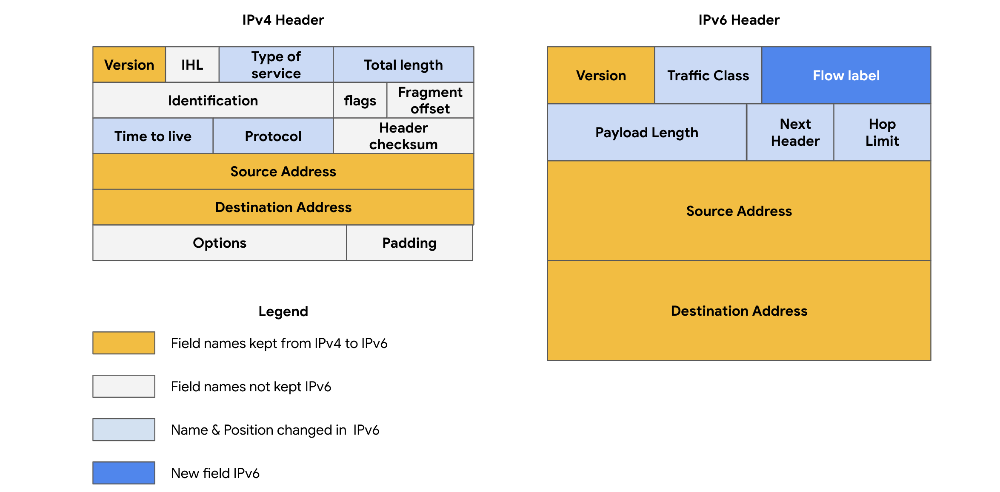

# **Table of Contents**

1. [Data Packet](#data-packet)  
2. [Bandwidth](#bandwidth)  
3. [TCP (Transmission Control Protocol)](#tcp)  
4. [IP (Internet Protocol)](#ip)  
5. [Port](#port)  
6. [TCP/IP Model](#tcpip-model)  
   - [Layers of TCP/IP Model](#layers-of-tcpip-model)  
7. [TCP Vs OSI Model](#tcp-vs-osi-model)  
8. [IP Address](#ip-address)  
   - [Types of IP Addresses](#types-of-ip-addresses)  
9. [MAC Address](#mac-address)  
10. [Network Protocols](#network-protocols)  
    - [Common Protocols](#common-protocols)  
11. [Wireless Protocols](#wireless-protocols)  
12. [Firewall](#firewall)  
13. [Stateful vs Stateless Firewalls](#stateful-vs-stateless-firewalls)  
14. [NGFWs (Next-Generation Firewalls)](#ngfws-next-generation-firewalls)  
15. [VPN (Virtual Private Network)](#vpn)  
    - [Encapsulation](#encapsulation)  
16. [Security Zone](#security-zone)  
17. [Subnetting](#subnetting)  
18. [Proxy Servers](#proxy-servers)  
    - [Types of Proxy Servers](#types-of-proxy-servers)  
19. [Common Network Intrusion Attacks](#common-network-intrusion-attacks)  
    - [Types of DoS Attacks](#types-of-dos-attacks)  
20. [Network Protocol Analyzer](#network-protocol-analyzer)  
21. [Botnets](#botnets)  
22. [Packet Sniffing](#packet-sniffing)  
23. [IP Spoofing](#ip-spoofing)  
24. [Security Hardening](#security-hardening)  
    - [OS Hardening Techniques](#os-hardening-techniques)  
25. [Virtual Machines (VMs)](#virtual-machines-vms)  
26. [Sandbox Environments](#sandbox-environments)  
27. [Network Security Hardening Techniques](#network-security-hardening-techniques)  
28. [SIEM Tool](#siem-tool)  
29. [IDS (Intrusion Detection System)](#ids)  
30. [IPS (Intrusion Prevention System)](#ips)  

---

### **Data Packet**
A data packet is a basic unit of information that travels from one device to another in the network.

**Parts of a Data Packet**:
- **Header**: Sender IP Address, Destination MAC Address, Protocol  
- **Body**: Content  
- **Footer**: Receiving Device Information  

---

### **Bandwidth**
The amount of data a device receives every second.

---

### **TCP (Transmission Control Protocol)**
TCP is an internet communication protocol that allows two devices to form a connection and stream data.

---

### **IP (Internet Protocol)**
IP is a set of standards used for routing and addressing packets as they travel between devices on a network.

---

### **Port**
A software-based location that organizes the sending and receiving of data between devices on a network.  
**Common Ports**:  
- **Port 25**: Email  
- **Port 443**: HTTPS  
- **Port 20**: Large File Transfers  

---

### **TCP/IP Model**
The TCP/IP model is a framework used to visualize how data is organized and transmitted across the network.

#### **Layers of TCP/IP Model**:
1. **Network Access Layer**: Handles the creation of data packets and their transmission across a network, including hardware devices like switches.
2. **Internet Layer**: Attaches IP addresses to data packets, indicating the sender's and receiver's locations, and focuses on inter-network connectivity.
3. **Transport Layer**: Controls traffic flow over the network, manages communication permissions, and includes error control mechanisms.
4. **Application Layer**: Defines how data packets interact with the receiving device, with protocols for tasks like file transfers and email services.

---

### **TCP Vs OSI Model**

---

### **IP Address**
An IP address is a unique string of characters that identifies the location of a device on the Internet.

#### **Types of IP Addresses**:
1. **IPv4**: Written as 1, 2, 3, or 4 digit numbers separated by decimal points. When IPv4 addresses became scarce, IPv6 was introduced. 
2. **IPv6**: An IPv6 address contains 32 characters, allowing for more devices to be connected to the internet. 

**IP Addresses can be**:  
- **Public**: Assigned by ISPs and used for internet-facing communications.  
- **Private**: Only visible within a local network and used for internal device communication.

---

### **MAC Address**
A unique alphanumeric identifier assigned to each physical device on a network.  
A switch reads the MAC address of the destination device and maps it to a port, storing this information in a MAC address table.

---

### **Network Protocols**
A set of rules used by devices to describe the structure and order of data delivery.

#### **Common Protocols**:
- **TCP**: Forms connections and streams data.
- **ARP**: Resolves MAC addresses of the next router or device in the path.
- **HTTPS**: Provides secure communication between clients and web servers.
- **DNS**: Translates domain names into IP addresses.
- **SNMP**: Used for managing network devices.
- **ICMP**: Reports data transmission errors.
- **UDP**: A connectionless protocol useful for fast transmissions.

---

### **Wireless Protocols**
- **IEEE 802.11 (WiFi)**: Standards defining wireless LAN communication.
- **WPA (WiFi Protected Access)**: A wireless security protocol for internet connections.
- **WEP (Wired Equivalent Privacy)**: Provides privacy on wireless networks similar to wired networks.

---

### **Firewall**
A network security device that monitors traffic to and from your network.

#### **Port Filtering**:
Blocks or allows specific port numbers to limit unwanted communication.

---

### **Stateful vs Stateless Firewalls**
- **Stateful**: Tracks information passing through it and proactively filters out threats.
- **Stateless**: Operates based on predefined rules and does not track data packets.

---

### **NGFWs (Next Generation Firewalls)**
- Deep packet inspection  
- Intrusion protection  
- Threat intelligence  

---

### **VPN (Virtual Private Network)**
A VPN hides your public IP address and encrypts your data, keeping it private while using public networks like the Internet.

#### **Encapsulation**:
A VPN process that wraps sensitive data inside other data packets for protection.

---

### **Security Zone**
A network segment that separates internal networks from the internet.

#### **Types of Security Zones**:
1. **Uncontrolled Zone**: External networks beyond the organization's control.  
2. **Controlled Zone**: A subnet that protects the internal network, including:  
   - DMZ  
   - Internal Network  
   - Restricted Zone  

---

### **Subnetting**
The division of a network into smaller logical groups, known as subnets, that help organize devices within a larger network.

---

### **Proxy Servers**
A server that fulfills client requests by forwarding them to other servers.

#### **Types of Proxy Servers**:
- **Forward Proxy Server**: Controls and restricts internet access.
- **Reverse Proxy Server**: Controls internet access to internal servers.

---

### **Common Network Intrusion Attacks**
- **DoS (Denial of Service) Attack**: Floods a network with traffic to disable it.
- **DDoS (Distributed Denial of Service) Attack**: A DoS attack using multiple sources to flood a target.

#### **Types of DoS Attacks**:
1. **SYN Flood Attack**: Overwhelms a server with TCP connection requests.
2. **ICMP Flood Attack**: Floods a server with ICMP packets.
3. **Ping of Death Attack**: Sends oversized ICMP packets to crash a target system.

---

### **Network Protocol Analyzer**
A tool used to capture and analyze data traffic within a network (e.g., Wireshark, tcpdump).

---

### **Botnets**
A collection of malware-infected computers under a single attacker's control, often used to carry out DDoS attacks.

---

### **Packet Sniffing**
The process of observing data as it moves across a network.

- **Passive Packet Sniffing**: Reading data in transit.
- **Active Packet Sniffing**: Manipulating data in transit.

---

### **IP Spoofing**
An attack where the source IP address is altered to impersonate an authorized system and gain access to a network.

---

### **Security Hardening**
Strengthening a system to reduce vulnerabilities and the attack surface.

#### **OS Hardening Techniques**:
1. Patch Updates  
2. Baseline Configuration  
3. Strong Password Policies  
4. Multi-factor Authentication (MFA)  
5. Hardware and Software Disposal  

---

### **Virtual Machines (VMs)**
Software versions of physical computers that provide secure, isolated environments to run code and test malware.

---

### **Sandbox Environments**
A secure testing environment for executing software or simulating attacks.

---

### **Network Security Hardening Techniques**
1. Port Filtering  
2. Network Access Privileges  
3. Encryption Standards  

Regularly performed tasks:  
- Firewall

 Configuration  
- Anti-virus Software Management  

---

### **SIEM Tool**
Security Information and Event Management tools monitor an organization's security status and alert analysts to potential threats.

---

### **IDS (Intrusion Detection System)**
Monitors network traffic for suspicious activity.

---

### **IPS (Intrusion Prevention System)**
Actively intercepts and mitigates threats to prevent harm to a network.

---
