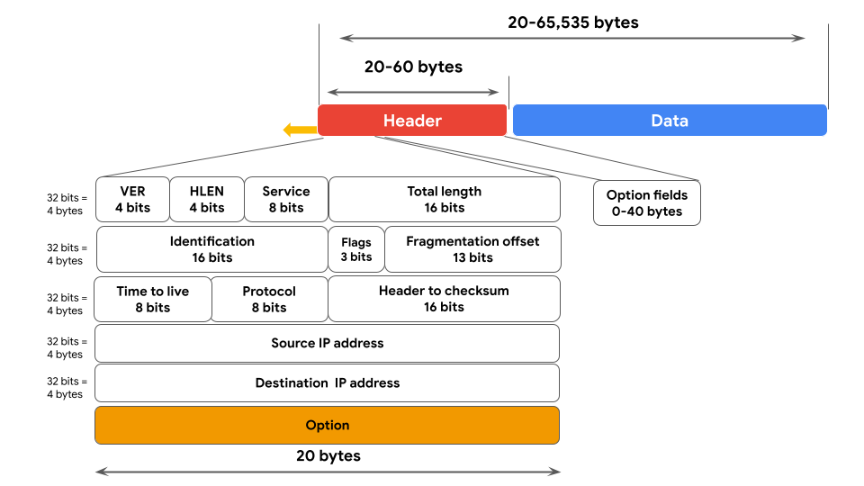

-> Data Packet : A data packet is a basic unit of information which travels from one device to another device in the network.
   
Data Packet has 3 parts : Header(Sender IP Address, Dest. MAC Address, Protocol), Body(Content) And Footer(Receiving Device Information)...

-> Bandwidth : The amount of data a device receives every second.

-> TCP : Transmission Control Protocol is an internet communication protocol that allows two devices to form a connection and stream data.

-> IP : Internet Protocol, is a set of standards used for routing and addressing packets as they travel between devices on a network.

-> Port : A software-based location that organizes the sending and receiving of data between devices on a network.
Ports divide network traffic into segments. The receiving device knows the priority based on these segments.

Port 25 - Email
Port 443 - HTTPS
Port 20 - Large File Transfers

-> TCP/IP Model : A framework used to visualize how data is organized and transmitted across the network.

Layers of TCP/IP Model :

1. Network Access Layer - Deals with creation of data packets and their transmission across a network,including hardware devices such as switches.

2. Internet Layer - Internet layer is where IP addresses are attached to data packets to indicate the location of the sender and the receiver. Also, it focuses on how the networks connect to each other.

3. Transport Layer - Includes protocols to control the flow of traffic over a network. These protocols permit or deny communication with other devices and include the status of the connection. Also includes Error Control.

4. Application Layer - Protocols determine how data packets will interact with the receiving device. Functions such as file transfers, E-mail services are present in this layer.

-> TCP Vs OSI Model :

-> IP Address : A unique string of character that identifies the location of a device on the Internet.

Two types :

1. IPv4 - Written as 1,2,3 or 4 digits numbers seperated by a decimal point. When IPv4 addresses got all used up, IPv6 was invented. 

2. IPv6 - Pv6 addresses are made up of 32 characters. The length of the IPv6 address will allow for more devices to be connected to the internet without running out of addresses as quickly as IPv4.

IP Addresses can be either :

1. Public -  Your internet service provider assigns a public IP address that is connected to your geographic location. When network communications goes out from your device on the internet, they all have the same public-facing address.

2. Private - Private IP addresses are only seen by other devices on the same local network. This means that all the devices on your home network can communicate with each other using unique IP addresses that the rest of the internet can't see.

-> MAC Address : A unique alphanumeric identifier that is assigned to each physical device on a network.

When a switch receives a data packet, it reads the MAC address of the destination device and maps it to a port. It then keeps this information in a MAC address table.

-> Network Protocols : A set of rules used by two or more devices on a network to describe the order of delivery and the structurte of the data.

TCP (Transmission Control Protocol) : Is an internet communication protocol that allows two devices to form a connection and stream data.

ARP (Address Resolution Protocol) : A network protocol used to determine the MAC address of the next router or device in path.

HTTPS (Hypertext transfer Protocol Secure) : A network protocol that provides a secure method of communication between clients and website servers.

DNS (Domain Name System) : A network protocol that translates internet domain names into IP addresses.

SNMP (Simple Network Management Protocol) : Is a network protocol used for monitoring and managing devices on a network. SNMP can reset a password on a network device or change its baseline configuration.

ICMP (Internet Control Message Protocol) : Is an internet protocol used by devices to tell each other about data transmission errors across the network. ICMP is used by a receiving device to send a report to the sending device about the data transmission.

UDP (User Datagram Protocol) :  Is a connectionless protocol that does not establish a connection between devices before a transmission. This makes it less reliable than TCP. But it also means that it works well for transmissions that need to get to their destination quickly.

-> Wireless Protocol :

IEEE 802.11 (WiFi) - A set of standards that define communication for wireless LANs.

WPA (WiFi Protected Access) - A wireless security protocol for devices to connect to the internet.

WEP (Wired Equivalent Privacy) - A wireless security protocol designed to provide users with the same level of privacy on wireless network connections as they have on wired network connections.

-> Firewall : A network security device that monitors traffic to and from your network.

Port Filtering : A firewall function that blocks or allows certain port numbers to limit unwanted communication.

Two Types - Hardware Firewall and Software Firewall.

-> Stateful : A class of firewall that keeps track of information passing through it and proactively filters out threats.

-> Stateless : A class of firewall that operates based on predefined rules and does not keep track of information from data packets. A stateless firewall only acts according to preconfigured rules set by the firewall administrator.

-> NGFWs (Next Generation Firewalls) : 

1. Deep packet inspection
2. Intrusion protection
3. Threat Interlligence

-> VPNs (Virtual Private Networks) : A network security service that changes your public IP address and hides your virtual location so that you keep your data private when you are using a public network like the internet.
They also encrypt your data.

-> Encapsulation : A process performed by a VPN service that protects your data by wrapping sensitive data in other data packets.

-> Security Zone : A segment of a network that protects the internal network from the internet.

Two types of security zones - 

1. Uncontrolled Zone - Any network outside the organization's control.

2. Controlled Zone - A subnet that protects the internal network from the uncontrolled zone.

Types of controlled zone - 

a. DMZ (Demilitarized Zone)
b. Internal Network
c. Restricted Zone

-> Subnetting : Subnetting is the subdivision of a network into logical groups called subnets. It works like a network inside a network. Subnetting divides up a network address range into smaller subnets within the network. These smaller subnets form based on the IP addresses and network mask of the devices on the network.

-> Proxy Servers : A server that fulfills the request of a client by forwarding them on to other servers.

-> Forward proxy server : Regulates and restricts a person's access to the internet.

-> Reverse proxy server : Regulates and restricts the internet's access to an internal server.

-> Common network intrusion attacks :

1. Malware
2. Spoofing
3. Packet Sniffing & Spoofing
4. Packet Flooding

-> DoS (Denial of service) Attack : An attack that targets a network or server and floods it with network traffic.

-> DDoS (Distributed denial of service) Attack : A type of DoS attack that uses multiple devices or services in different locations to flood the target network with unwanted traffic.

-> A network-level Denial of Service attacks targets Network bandwidth.

-> 3 Common Network Level DoS Attacks :

1. SYN (synchronize) flood attack - A type of DoS attack that simulates a TCP connection and floods a server with SYN packets.

2. ICMP (Internet Control Mesage Protocol) flood attack - A type of DoS attack performed by an attacker repeatedly sending ICMP packets to a network server.

3. Ping of death attack - A type of DoS attack caused when a hacker pings a system by sending it an oversized ICMP packet that is bigger than 64 KB.

-> A network protocol analyzer, sometimes called a packet sniffer or a packet analyzer, is a tool designed to capture and analyze data traffic within a network.
Some of them are : SolarWinds NetFlow Traffic Analyzer, Wireshark, tcpdump (CLI).

-> Botnets :  A botnet is a collection of computers infected by malware that are under the control of a single threat actor, known as the “bot-herder." Each computer in the botnet can be remotely controlled to send a data packet to a target system. In a botnet attack, cyber criminals instruct all the bots on the botnet to send data packets to the target system at the same time, resulting in a DDoS attack.

-> Packet Sniffing : Packet sniffing is the practice of using software tools to observe data as it moves across a network.

1. Passive packet sniffing : A type of attack where data packets are read in transit.

2. Active packet sniffing : A type of attack where data packets are manipulated in transit.

-> IP Spoofing : A network attack performed when an attacker
changes the source IP of a data packet to impersonate an authorized system and gain access to a network.

Common IP Spoofing attacks - 

1. On-path attacks : An attack where a malicious actor places themselves in the middle of an authorized connection and intercepts or alters the data in transit.

2. Replay attacks : A network attack performed when a amlicious actor intercepts a data packet in transit and delays ir or repeats it at another time.

3. Smurf attacks : A network attack performed when an attacker sniffs an authorized user's IP address and floods it with packets.

-> Security Hardening : The process of strengthening a system to reduce its vulnerability and attack surface.

-> Attack surface : All the potential vulnerabilities that a threat actor could exploit.

-> Security hardening is conducted on - 

1. Hardware
2. Operating Systems
3. Applications
4. Computer Networks
5. Databases

-> Penetration test : A simulated attack that helps identify vulnerabilities in systems, networks, websites, applications, and processes.

-> OS (Operating System) : The interface between computer hardware and the user.

-> OS (Operating System) Hardening Techniques: 

1. Patch update : A software and operating system update that addresses security vulnerabilities within a program or output.

2. Baseline configuration (Baseline image) : A documented set of specifications within a system that is used as a basis for future builds, releases, and updates.

3. Hardware and Software Disposal : This ensures that all old hardware is properly wiped and disposed of. It's also a good idea to delete any unused software applications since some popular programming languages have known vulnerabilities. Removing unused software makes sure that there aren't any unnecessary vulnerabilities connected with the programs that the software uses.

4. Implementing Strong Password Policy : Strong password policies require that passwords follow specific rules.

5. MFA (Multi-factor authentication) : A security measure which requires a user to verify the identity in two or more ways to access a system or network.

-> VMs (Virtual Machines) : Virtual machines (VMs) are software versions of physical computers. VMs provide an additional layer of security for an organization because they can be used to run code in an isolated environment, preventing malicious code from affecting the rest of the computer or system. VMs can also be deleted and replaced by a pristine image after testing malware. 

-> Sandbox Environments : A sandbox is a type of testing environment that allows you to execute software or programs separate from your network. They are commonly used for testing patches, identifying and addressing bugs, or detecting cybersecurity vulnerabilities. Sandboxes can also be used to evaluate suspicious software, evaluate files containing malicious code, and simulate attack scenarios.

-> Network Security Hardening Techniques :

1. Port filtering
2. Network access privilege
3. Encryption

Regularly performed tasks :

a. Firewall rules maintenance
b. Network log analysis : The process of examining network logs to identify events of interest.
c. Patch updates
d. Server backups

-> SIEM (System Information and Event Management) Tool : An Application that collects and analyzes log data to monitor critical activities in an organization.

Singularly performed tasks : 

a. Port filtering : A firewall function that blocks or allows certain port numbers to limit unwanted communication.
b. Network segmentation 
c. Encryption Standards

-> IDS (Intrusion Detection System) : An intrusion detection system (IDS) is an application that monitors system activity and alerts on possible intrusions. An IDS alerts administrators based on the signature of malicious traffic.

-> IPS (Intrusion Prevention System) : An intrusion prevention system (IPS) is an application that monitors system activity for intrusive activity and takes action to stop the activity. It offers even more protection than an IDS because it actively stops anomalies when they are detected, unlike the IDS that simply reports the anomaly to a network administrator.

-> Cloud Network : A collection of servers or computers that stores resources and data in remote data centres that can be accessed via the internet.

-> Cloud Security Hardening Techniques : 

1. IAM (Identity access management) : It is a collection of processes and technologies that helps organizations manage digital identities in their environment. This service also authorizes how users can leverage different cloud resources.

2. Hypervisors : A hypervisor abstracts the host’s hardware from the operating software environment. There are two types of hypervisors.

3. Baselining : Baselining for cloud networks and operations cover how the cloud environment is configured and set up. A baseline is a fixed reference point.

4. Cryptography : Cryptography can be applied to secure data that is processed and stored in a cloud environment. 

