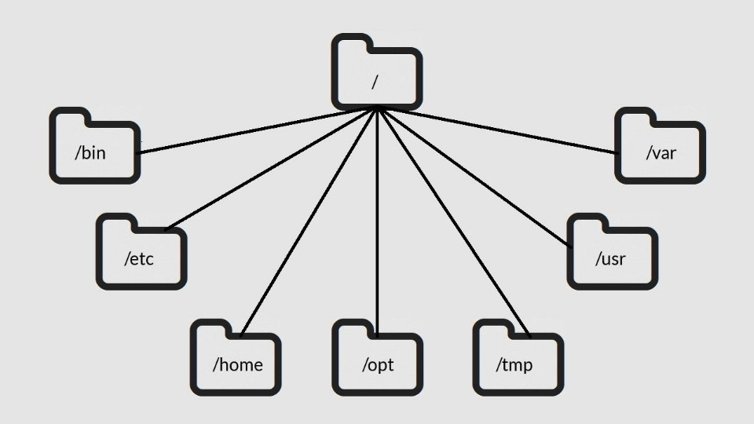
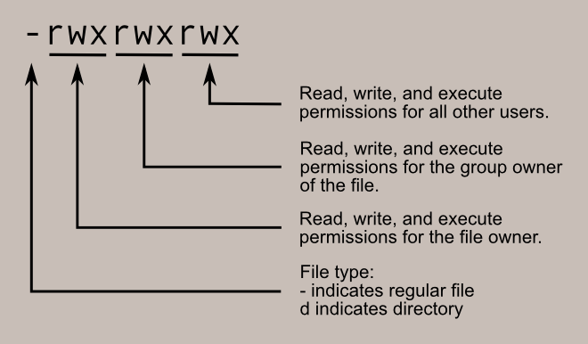

-> Operating Systems : It's the interface between the computer hardware and the user. The operating system, or the OS as it's commonly called, is responsible for making the computer run as efficiently as possible while also making it easy to use.

-> Hardware : Physical components of a computer.

-> Application : A program that performs a specific task.

-> Applications send request to Operating Systems, which is then forwaded to the hardware by the Operating System. Also, the hardware commuicates with the Operating system which is then forwaded to the application by the Operating System.

-> When you boot, or turn on, your computer, either a BIOS or UEFI microchip is activated. The Basic Input/Output System (BIOS) is a microchip that contains loading instructions for the computer and is prevalent in older systems. The Unified Extensible Firmware Interface (UEFI) is a microchip that contains loading instructions for the computer and replaces BIOS on more modern systems. Then they perform various loading instructions and at the last they activate the bootloader, which is a software program the boots the operating system.

-> Resource Allocation via OS : The OS handles resource and memory management to ensure the limited capacity of the computer system is used where it's needed most. A variety of programs, tasks, and processes are constantly competing for the resources of the central processing unit, or CPU.

-> Virtual Machine ; A virtual machine (VM) is a virtual version of a physical computer.

-> virtualization : Virtualization is the process of using software to create virtual representations of various physical machines.

-> Interface : A user interface is a program that allows a user to control the functions of the operating system.

-> Graphical User Interface (GUI) : A GUI is a user interface that uses icons on the screen to manage different tasks on the computer. Most operating systems can be used with a graphical user interface. Basic GUI components are - Start menu, Task bar, Desktop with icons and shortcuts.

-> Command Line Interface (CLI) : The command-line interface, or CLI, is a text-based user interface that uses commands to interact with the computer. These commands communicate with the operating system and execute tasks like opening programs.

-> Linux : An open-source operating system.

-> GNU was also an operating system based on UNIX. Stallman shared Torvalds' goal of creating software that was free and open to anyone. After working on GNU for a few years, the missing element for the software was a kernel.

-> Components of Linux -

User - The user is the person interacting with a computer.

Applications - An application is a program that performs a specific task.

Shell - The shell is the command-line interpreter.

Filesystem Hierarchy Standard - The Filesystem Hierarchy Standard (FHS) is the component of the Linux OS that organizes data. It specifies the location where data is stored in the operating system.

Kernel - The kernel is the component of the Linux OS that manages processes and memory.

Hardware - The hardware is the physical components of a computer.

-> Different Distros of Linux - 

1. Red Hat Enterprise Linux (CentOS)
2. Slackware (SUSE)
3. Debian (Ubuntu and Kali Linux)

-> Penetration Testing :  A penetration test is a simulated attack that helps identify vulnerabilities in systems, networks, websites, applications, and processes.

E.g. -  Metasploit can be used to look for and exploit vulnerabilities on machines.

Burp Suite is another tool that helps to test for weaknesses in web applications.

John the Ripper is a tool used to guess passwords.

-> Digital Forensic Tool in Kali - tcpdump, Wireshark, autopsy, etc.

-> A package is a piece of software that can be combined with other packages to form an application. Some packages may be large enough to form applications on their own.

-> A package manager is a tool that helps users install, manage, and remove packages or applications. Linux uses multiple package managers.

-> Shell - The shell is the command-line interpreter. That means it helps you communicate with the operating system through the command line.

-> Types of Shell - 

1. Bourne-Again Shell (bash)

2. C Shell (csh)

3. Korn Shell (ksh)

4. Enhanced C shell (tcsh)

5. Z Shell (zsh)

-> Standard Input - Information received by the OS via the command line. String data is the input entered by the user.

-> Standard Output - Information returned by the OS through the Shell.

-> Standard Error - Error messages returned by the Os  through the shell.

-> Security Analysts - 
i. Work with server logs
ii. Navigate, manage, and analyze files remotely
iii. Verify and configure users and group access
iv. Give authorization and set file permissions

-> Command - An instruction given to the computer to perform a specific task.

-> Argument - Specific information needed by a command.

-> Filesystem Hierarchy Standard (FHS) - The component of the Linux OS that organizes data.

-> Root - The highest-level directory in Linux.

-> Basic commands in Linux - 

1. pwd - Prints the current working directory.
2. ls - Displays the names of files and directories in the current working directory.
3. cd - Navigates between directories.
4. grep - Searches a specified file ands returns the lines in the file containing the specified string.
5. | (piping) - Sends the standard output of one command as input to another command for further processing.
6. mkdir - Makes a new director.
7. rmdir - Removes a directory.
8. touch - Creates a new file.
9. mv - Moves a file or a directory into a new location.
10. cp - Copies a file or a directory into a new location.

-> File permissions and ownership - 

Types of File permissions - 
i. read (r)
ii. write (w) 
iii. execute (x)

Types of owners - 
i. User (u)
ii. Group (g)
ii. Other (o)

-> Options - Options modify the behaviour of Linux commands.
For e.g. - 

1. ls -l, here -l is an option which displays permissions to files and directories.

2. Hidden files can be displayed using the -a option.

-> Changing permissions for users - 

i. chmod - Changes permissions on files and directories.

e.g. chmod u+x access.txt (Adds execute permissions for user)

-> Problem of logging in as root - 

1. Security Risks
2. Irreversible Mistakes
3. Accountability

-> sudo - Temporarily grants elevated permissions to specific users.
-> useradd - Adds a user to the system.
-> userdel - Deletes a user from the system.

-> man - Displays information on other commands and how they work.

-> whatis - Displays a description of a command on a single line.

-> apropos - Searches the manual pages for a specific string.

-> Databases and SQl - 

-> Database - An organized collection of information or data.

-> Relational Database - A structured database containing tables that are related to each other.

-> Primary key - A column where every row has a unique entry.`

-> Foreign key - A column in a table that is a primary key in another table.

-> SQL - Structured Query Language. A programming language used to create, interact with, and request information from a database.

-> Query - A request for data froma  database table or a combination of tables.

-> Log - A record of events that occur within an organization's systems.

-> SQL Queries Keywords - 

1. SELECT - Indicates which columns to return.
2. FROM - Indicates which table to query.
3. WHERE - Indicates the condition for a filter.

-> SQL Operators - 

1. LIKE - Pattern matching use with WHERE clause.
2. BETWEEN - An operator that filters for numbers or dates within a range.
3. AND - Specifies that both conditions must be met simultaneously.
4. OR - Specifies that either condition must be met.
5. NOT - Negates a condition.

-> Common Data Types - 

1. String - Data consisting of an ordered sequence of characters.
2. Numeric - Data consisting of numbers.
3. Date and Time - Data representing a date and/or time.

-> Joining Tables - 

In SQL statements that contain two columns, SQL needs to know which column we're referring to. The way to resolve this is by writing the name of the table first, then a period, and then the name of a column.

Syntax - table.column_name

Types of Joins :

1. INNER JOIN - Returns rows matching on a specified column that exists in more than one table.

2. OUTER JOIN - These are of 3 types.

    i. LEFT JOIN - Returns all of the records of the first table, but only returns rows of the second table that match ona specified column.

    ii. RIGHT JOIN - Returns all of the records of the second table, but only returns rows from the first table that match on a specified column.

    iii. FULL OUTER JOIN - Returns all records from both queried tables.

